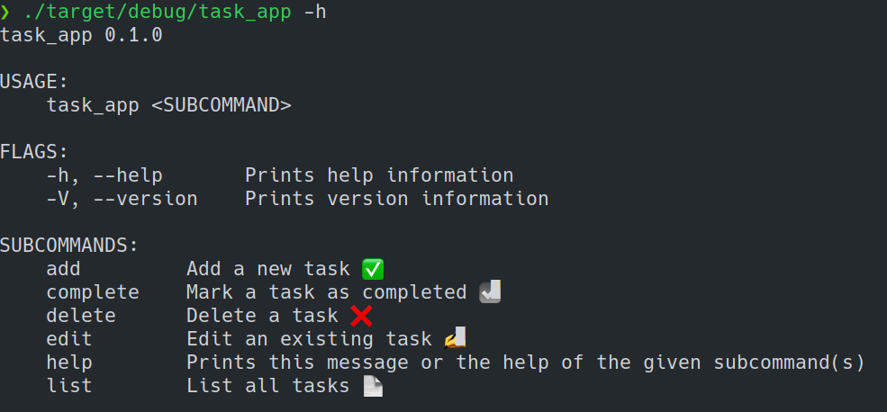

# Rust Terminal Task App ✍️

A **terminal task app** made with rust.



## Delete


## Add


## List


## Edit


## Complete


## Install

Clone, build and execute.
You must first have [cargo](https://doc.rust-lang.org/cargo/getting-started/installation.html) installed.

```bash
git clone https://github.com/EduardYan/rust-task-app.git
cd rust-task-app
```

```bash
cargo build
```

```bash
./target/debug/task_app -h
```
